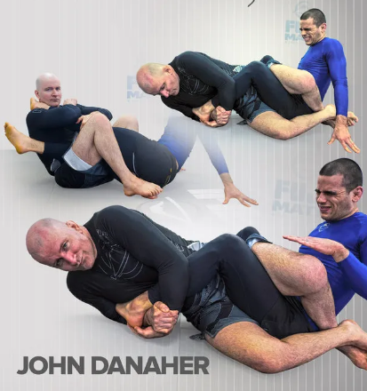

# Fine-tuning an LLM into a BJJ Coach

<p align="center">
  
</p>

Let's train an LLM into speaking like John Danaher, arguably one of the greatest BJJ coach.

**Try asking for his guidance!**

Simply launch the app with `python app.py`


## Training Data
John Danaher regularly write high quality posts on Instagram where he develops ideas around BJJ in his captions. 
We will download these captions and feed them into a pre-trained LLM for supervised fine-tuning. This work is done in `notebooks/data_collector.ipynb` notebook where we scrap instagram and store the relevant data into the `data/danaher_data.csv` file.

## Pre-Trained Model
We use the *mistral7B* open-source model from MistralAI available on Hugging Face.

## Supervised fine-tuning : QLoRA
We utilize the *QLoRA* training to greatly reduce both the training computational cost and memory footprint. This modern technique is readily available in python through the peft librairy and will allow us to conduct the training on consumer hardware !

## Gradio Web-App
We build a simple gradio app to demo the model.

<!-- ROADMAP -->
## Roadmap
- [ ] Add possibility to choose an open-source LLM and lauch a fine-tuning job easily
- [ ] Instead of fine-tuning, explore RAG solutions
- [ ] Instead of fine-tuning, try to build an instruct-like dataset and compare different methods like RLHF and DPO


<!-- GETTING STARTED -->
## Getting Started

Simple instructions to get started running the notebooks and using the web-app.

### Installation

1. Clone the repo
   ```sh
   git clone https://github.com/NicolasPllr1/bjj_coach.git
   ```
2. Install python dependancies
   ```sh
   pip install -r requirements.txt
   ```
### Usage

Simply launch the app with `python app.py`